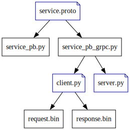

# Build
```shell
# install libs
pip install -r requirements.txt -i https://mirrors.aliyun.com/pypi/simple

# generate 'service_pb2.py' and 'service_pb2_grpc.py'
export PROTO_DIR=.
export PYTHON_OUTPUT_DIR=.
export GRPC_PYTHON_OUTPUT_DIR=.
mkdir -p ${PYTHON_OUTPUT_DIR} && mkdir -p ${GRPC_PYTHON_OUTPUT_DIR}
python3 -m grpc_tools.protoc -I${PROTO_DIR} --python_out=${PYTHON_OUTPUT_DIR} --grpc_python_out=${GRPC_PYTHON_OUTPUT_DIR} $(find ${PROTO_DIR} -name '*.proto')

```
<center></center>

# Run
# Start server
```shell
python3 server.py

# Server started on port 50051
# Get request:
# name: "alice"
# age: 15

# Get request:
# name: "alice"
# age: 15

# Get request:
# id: "0x1234"

# send 1/4 chunk for request id 0x1234
# send 2/4 chunk for request id 0x1234
# send 3/4 chunk for request id 0x1234
# send 4/4 chunk for request id 0x1234
# Completed streaming for request id 0x1234
```
# Start client
```shell
python3 client.py # generate 'request.bin' and 'response.bin'

# ++++ test GetData rpc +++++
# Get response:
# names: "bob"
# names: "mike"
# names: "lisa"
# age: 20

# +++++ load request.bin as GRPC request +++++
# Get response:
# names: "bob"
# names: "mike"
# names: "lisa"
# age: 20

# +++++ test StreamData rpc +++++
# recv: chunk: "chunk0"

# recv: chunk: "chunk1"

# recv: chunk: "chunk2"

# recv: chunk: "chunk3"

```
